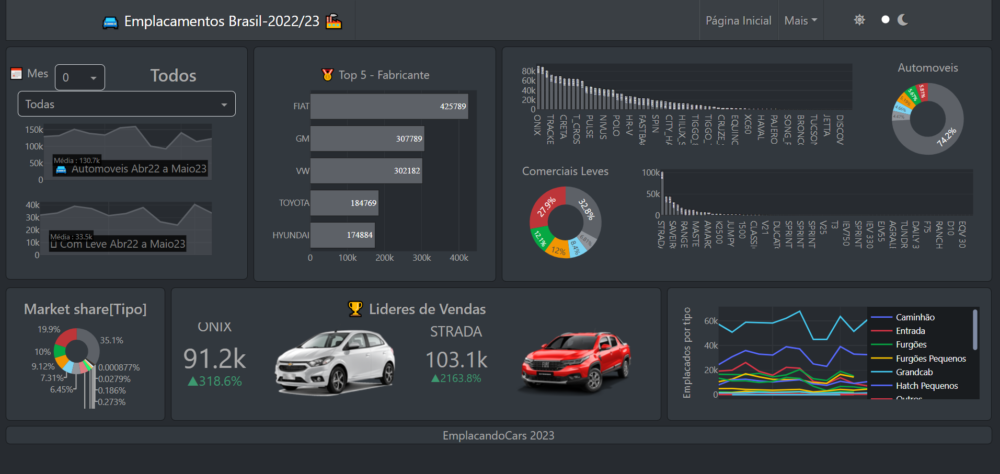

# emplacandocars
Repositorio para deploy do emplacando cars - Fase Beta

# 🚘 EmplacandoCars: Análise Interativa de Emplacamentos no Brasil (2022-2023) 🏭




## ✨ Desvendando o Mercado Automotivo Brasileiro com Dados

Bem-vindo ao **EmplacandoCars**! Este projeto é um dashboard interativo construído em Python utilizando o poderoso framework Dash e a biblioteca Plotly. Seu objetivo é oferecer uma visão clara e dinâmica sobre o cenário de emplacamentos de veículos leves (automóveis e comerciais leves) no Brasil, com base nos dados mais recentes disponíveis para 2022 e 2023.

Seja você um entusiasta do mercado automotivo, um analista de dados ou alguém interessado em entender as tendências de vendas, o EmplacandoCars fornece as ferramentas visuais para explorar os dados de forma intuitiva.

## 📊 Funcionalidades Principais

*   **Visão Geral do Mercado:** Acompanhe o volume total de emplacamentos por mês e por categoria (Automóveis e Comerciais Leves).
*   **Filtros Dinâmicos:** Explore os dados de emplacamentos selecionando meses específicos ou filtrando por fabricantes.
*   **Tendências Históricas:** Visualize a evolução mensal dos emplacamentos para ambas as categorias ao longo do período analisado (Abr/2022 a Mai/2023).
*   **Top Fabricantes:** Descubra quais são os 5 fabricantes com maior volume de emplacamentos no período ou mês selecionado.
*   **Top Modelos:** Veja o ranking dos 5 modelos mais emplacados em cada categoria (Automóveis e Comerciais Leves), detalhados por fabricante e modelo.
*   **Líderes do Mês:** Identifique rapidamente o modelo líder de vendas do mês selecionado para cada categoria, com um indicador de sua performance em relação à média.
*   **Market Share:** Entenda a proporção de vendas entre Automóveis e Comerciais Leves.
*   **Temas Personalizáveis:** Alterne facilmente entre os temas de interface claro e escuro para uma melhor experiência visual.
*   **Design Responsivo:** Acesse o dashboard em diferentes dispositivos (desktop, tablet, mobile) graças ao layout adaptável baseado em Bootstrap.

## 🛠️ Tecnologias Utilizadas

*   **Python:** Linguagem de programação principal.
*   **Dash:** Framework web para a construção de dashboards analíticos.
*   **Plotly:** Biblioteca robusta para criação de gráficos interativos e visualizações de dados.
*   **Pandas:** Ferramenta essencial para manipulação, limpeza e análise dos dados.
*   **Dash Bootstrap Components (dbc):** Componentes de interface baseados no Bootstrap para um layout responsivo e estilizado.
*   **Dash Bootstrap Templates:** Integração e seleção de temas Bootstrap para Dash.
*   **Font Awesome:** Ícones utilizados na interface.

## 📚 Fonte dos Dados

Os dados utilizados neste projeto foram compilados com base em informações públicas disponibilizadas pela **Fenabrave** (Federação Nacional da Distribuição de Veículos Automotores), uma referência no mercado automotivo brasileiro.

🔗 [Acesse o site da Fenabrave para mais informações](https://www.fenabrave.org.br/)

## 🚀 Como Rodar o Projeto Localmente

Siga os passos abaixo para configurar e executar o dashboard na sua máquina:

1.  **Pré-requisitos:** Certifique-se de ter o Python 3.6+ instalado.
2.  **Clone o Repositório:**
    ```bash
    git clone https://github.com/seu-usuario/nome-do-seu-repositorio.git
    cd nome-do-seu-repositorio
    ```
    *(Substitua `seu-usuario/nome-do-seu-repositorio` pelo caminho correto do seu repositório no GitHub)*
3.  **Crie um Ambiente Virtual (Recomendado):**
    É uma boa prática isolar as dependências do projeto.
    ```bash
    python -m venv .venv
    source .venv/bin/activate # No Windows use `.\.venv\Scripts\activate`
    ```
4.  **Instale as Dependências:**
    Instale as bibliotecas necessárias. Se você tiver um arquivo `requirements.txt` gerado, use `pip install -r requirements.txt`. Caso contrário, instale-as manualmente:
    ```bash
    pip install dash plotly pandas dash-bootstrap-components dash-bootstrap-templates
    ```
5.  **Estrutura de Arquivos:**
    Certifique-se de que a estrutura do seu projeto inclua:
    *   O arquivo de dados: `dataset_CarSales.csv` na raiz do projeto.
    *   A pasta de assets: `assets/` contendo as imagens (`Automovel.png`, `Comercial.png`, e as imagens dos modelos líderes, além da `screenshot.png`).
6.  **Execute o Aplicativo:**
    ```bash
    python seu_arquivo_principal.py
    ```
    *(Substitua `seu_arquivo_principal.py` pelo nome do arquivo Python que contém o código do seu dashboard)*
7.  **Acesse o Dashboard:**
    Abra seu navegador web e navegue para `http://127.0.0.1:8050/`.

## 📁 Estrutura do Projeto
